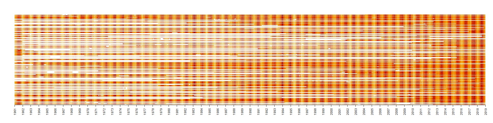

## Introduction

This repository was forked from:
https://github.com/manmatej/chmu-process

in order to adjust it for use in GNU/Linux and add scripts for processing other needed parameters like minimum and maximum temperature and preciptitation.
With my almost zero experience with R-Project some of the changes and suggested procedures might look clumsy but it worked and there was no reason for deep studies of R-Project for this one time use. So, "quick and dirty" approach was often used.

Scripts with my modifications are available in the "R-project_modified_processing_scripts" folder, with further description. Modified downloading script is also there.

## Important changes

Workaround to use the scripts in GNU/linux. Added scripts for min, max temperature and precipitation. Added howto.

original description by Matěj Man:

## Series of scripts to handle CHMU data

### Poloha stanic merge
This script build upon Oto Kalab’s one, you can find here https://github.com/kalab-oto/chmu-poloha-stanic Use this script to merge into single file and filter duplicates. The output is also in this repository. You can simply download to proceed with downloading data. (stanice_ids.csv)

### Downloading script
To run this one, you need ids of stations. You can process them yourself or use “stanice_ids.csv” Script will download I hope all data, or you can decide which data. See: https://www.chmi.cz/historicka-data/pocasi/denni-data/Denni-data-dle-z.-123-1998-Sb
Result is bunch of zip files. 

### Unzip process
This one will handle downloaded zips. Only mean air temperature as example. Unzip, and process into flat data frame starting 01.01.1961 ending 31.01.2019. 

### Missing values
There are a lot of missing data, individual station vary in logging period. Y axis shows stations, X axis time. 

### Various station location in time
In scripts I ignored variabe position of measuring point in time. Inside CSV files, there are aditional metadata like precise coordinates of measuring device in time. My scripts ignores it and simply merge all data by station ID ignorig spatial shift. 
