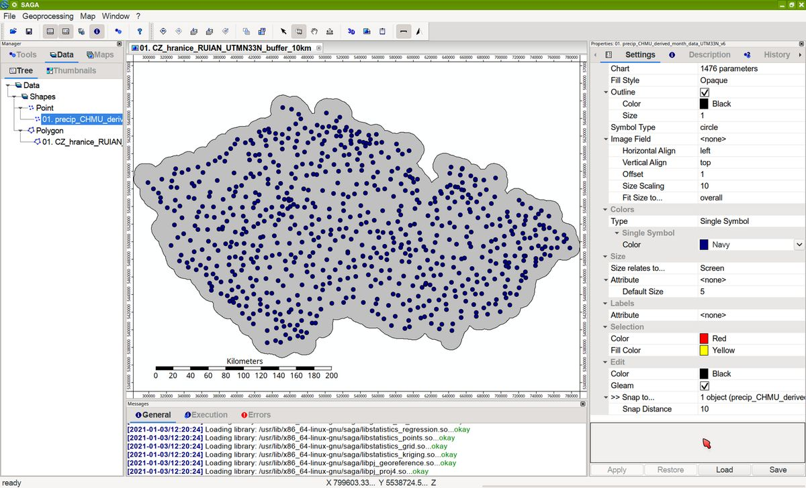
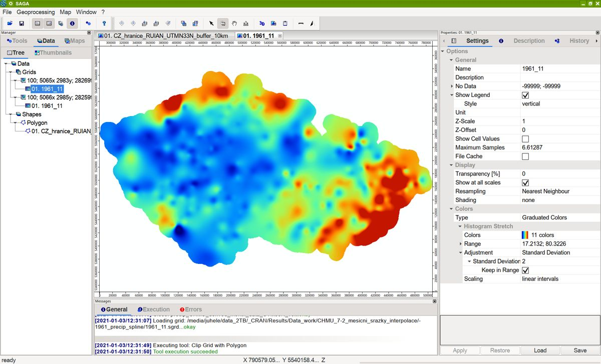

## Historická meteo data České Republiky pro období 1961-2019

## Úvod

K dispozici jsou data denních teplot vzduchu (minimální, průměrné, maximální) a denních srážkových úhrnnů za období 1961-2019, která zpřístupnil Český hydrometeorologický ústav (dále jen „ČHMÚ“) v souladu se zákonem 123/1998 Sb. o právu na informace o životním prostředí:

https://www.chmi.cz/historicka-data/pocasi/denni-data/Denni-data-dle-z.-123-1998-Sb

## Podmínky užití dat

Podmínky užití dat jsou uvedeny zde na webu ČHMÚ:

https://www.chmi.cz/files/portal/docs/meteo/ok/denni_data/Podminky_uziti_udaju.pdf

PDF verzi dokumentu výše a odkaz na web obsahuje i každý datový balíček.

## CSV data

Jedná se o data denních teplot vzduchu (minimální, průměrné, maximální) a denních srážkových úhrnnů za období 1961-2019, stažená za pomocí zde zveřejněných skriptů pro R-project, které pocházejí z:
https://github.com/manmatej/chmu-process

a byly upraveny pro pro běh v operačním systému GNU/Linux. V důsledku toho mají i výsledná data kódování UTF-8 místo původně použitého CP1250. Jinak nebyla tato data nijak upravována.

## Odvozená měsíční data

### Odvozené měsíční srážkové úhrny (CSV)

S ohledem na problémy při snaze svépomocí upravit skripty pro R-project ke stažení a zpracování měsíčních dat ČHMÚ jsem nakonec přistoupil k jejich napočítání z dat denních. Při zpracování dělaly problém hodnoty "NA" pro chybějící data, ze kterých se při některých výpočtech stávaly nuly a bylo potřeba je odlišit od regulérních nulových srážek. Proto byly hodnoty "NA" následně nahrazeny za údaj "-999" aby ve výpočtech (např. programem SAGA-GIS) bylo možné tuto hodnotu nastavit jako "žádná data" a program je nezahrnul do výpočtu (např. interpolace).

Pro případný výpočet obdobného typu dat jako jsou "Územní srážky" byly vypočteny tzv. normálové hodnoty - "Standardní klimatické normály dle WMO jsou počítány jako 30leté průměry teploty, srážek a dalších klimatických prvků."
viz:

PŘECHOD NA KLIMATICKÝ NORMÁL 1981 – 2010

Lenka Crhová, Slávek Podzimek, 2017-06-07  07:01 UTC

http://www.infomet.cz/index.php?id=read&idd=1496819280

Normálové hodnoty byly tedy počítány pro jednotlivé meteo stanice, jako průměry pro období 1961-1990 a 1981-2010, v tabulkovém procesoru LibreOffice Calc, s využitím funkce "AVERAGEIF" aby bylo možné vyloučit z výpočtu hodnoty "NA" či "-999".

V datasetu jde o sloupce obsahující "N", rok konce období normálu a číslo měsíce:

pro 1961-1990 např. N1990_12	

pro 1981-2010 např. N2010_01

Pokud má normálová hodnota velikost -999, pak pro dané období a stanici nebyla data srážek k dispozici.

Ačkoliv byla tato odvozená data průběžně namátkově kontrolována, nemůže autor po formální stránce garantovat jejich bezchybnost a jejich další použití je tedy na vlastní riziko.

## GIS data

### Odvozené měsíční srážkové úhrny (GIS data)

Autorem skriptu pro získání dat polohy stanic je Oto Kaláb: https://github.com/kalab-oto/chmu-poloha-stanic a data samotná byla beze změn převzata z https://github.com/manmatej/chmu-process. 

Data jsou ve standardním formátu OGC GeoPackage (https://www.geopackage.org) a souřadnicovém systému EPSG:32633 - WGS 84 / UTM zone 33N (https://epsg.io/32633). Atributová tabulka nicméně obsahuje i původní souřadnice v systému EPSG:4326 - WGS 84 (https://epsg.io/4326) (GPS souřadnice). Jako ukázka je ve výchozím stavu použit přechodový styl s odstupňováním barev podle měsíce listopadu 2019.

### Odvozená územní měsíční srážková data (GIS data)

Cílem bylo získat z dat uvolněných ČHMÚ obdobná data jako jsou uváděné [Územní srážky](https://www.chmi.cz/historicka-data/pocasi/uzemni-srazky), která jsou ovšem publikována pod licencí [CC BY-NC-ND](https://creativecommons.org/licenses/by-nc-nd/3.0/cz/), která brání jejich dalšímu zpracování: "Nezasahujte do díla — Pokud dílo zpracujete, zpracujete s jinými díly, doplníte nebo jinak změníte, nesmíte toto upravené dílo dále šířit."

Výše uvedená data odvozených měsíční srážkový úhrnů byla interpolována v programu SAGA-GIS (http://www.saga-gis.org) s využitím metody Multilevel B-Spline, cellsize 100 m. Interpolační algoritmus pracuje v obdélníkové oblasti, ale pro potřeby budoucího ořezu dat byla tato oblast nastavena větší, podle hranic ČR s 10 km přesahem (buffer). Program byl nastaven tak, aby do interpolace nebyly zahrnuty body stanic, které v dané období neměly k dispozici žádná data (ve výše zmíněném datasetu hodnoty -999).

Výstupem je tedy obdélníková interpolovaná mapa, která po ořezu může vypadat asi takto:

Kvůli zatím nedořešené automatizaci procesu byla provedena pouze interpolace manuálně spuštěná přes SAGA_GUI pro vybraná data a normálnové hodnoty.

#### Odvozené územní měsíční normálové srážkové úhrny (GIS data)(v přípravě)

### Reference:

[SAGA-GIS Tool Library Documentation (v7.3.0) - Tool Multilevel B-Spline](http://www.saga-gis.org/saga_tool_doc/7.3.0/grid_spline_4.html)

Lee, S., Wolberg, G., Shin, S.Y. (1997): Scattered Data Interpolation with Multilevel B-Splines. IEEE Transactions On Visualisation And Computer Graphics, Vol.3, No.3., p.228-244. [available from ResearchGate](https://www.researchgate.net/profile/George_Wolberg/publication/3410822_Scattered_Data_Interpolation_with_Multilevel_B-Splines/links/00b49518719ac9f08a000000/Scattered-Data-Interpolation-with-Multilevel-B-Splines.pdf).
