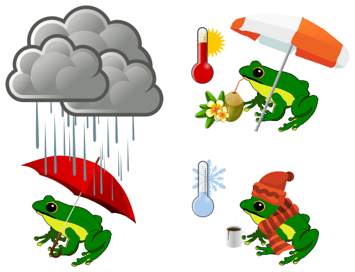

## Historická meteo data České Republiky pro období 1961-2019

## Úvod

K dispozici jsou data denních teplot vzduchu (minimální, průměrné, maximální) a denních srážkových úhrnnů za období 1961-2019, která zpřístupnil Český hydrometeorologický ústav (dále jen „ČHMÚ“) v souladu se zákonem 123/1998 Sb. o právu na informace o životním prostředí:

https://www.chmi.cz/historicka-data/pocasi/denni-data/Denni-data-dle-z.-123-1998-Sb

## Podmínky užití dat

Podmínky užití dat jsou uvedeny zde na webu ČHMÚ:

https://www.chmi.cz/files/portal/docs/meteo/ok/denni_data/Podminky_uziti_udaju.pdf

PDF verzi dokumentu výše a odkaz na web obsahuje i každý datový balíček.

## CSV data

Jedná se o data denních teplot vzduchu (minimální, průměrné, maximální) a denních srážkových úhrnnů za období 1961-2019, stažená za pomocí zde zveřejněných skriptů pro R-project, které pocházejí z:
https://github.com/manmatej/chmu-process

a byly upraveny pro pro běh v operačním systému GNU/Linux. V důsledku toho mají i výsledná data kódování UTF-8 místo původně použitého CP1250. Jinak nebyla tato data nijak upravována.

## Odvozená měsíční data

### Odvozené měsíční srážkové úhrny (GIS data v přípravě)

S ohledem na problémy při snaze svépomocí upravit skripty pro R-project ke stažení a zpracování měsíčních dat ČHMÚ jsem nakonec přistoupil k jejich napočítání z dat denních. Při zpracování dělaly problém hodnoty "NA" pro chybějící data, ze kterých se při některých výpočtech stávaly nuly a bylo potřeba je odlišit od regulérních nulových srážek. Proto byly hodnoty "NA" následně nahrazeny za údaj "-999" aby ve výpočtech (např. programem SAGA-GIS) bylo možné tuto hodnotu nastavit jako "žádná data" a program je nezahrnul do výpočtu (např. interpolace).

Pro případný výpočet obdobného typu dat jako jsou "Územní srážky" byly vypočteny tzv. normálové hodnoty - "Standardní klimatické normály dle WMO jsou počítány jako 30leté průměry teploty, srážek a dalších klimatických prvků."
viz:

PŘECHOD NA KLIMATICKÝ NORMÁL 1981 – 2010

Lenka Crhová, Slávek Podzimek, 2017-06-07  07:01 UTC

http://www.infomet.cz/index.php?id=read&idd=1496819280

1961-1990
1981-2010

Ačkoliv byla tato odvozená data průběžně namátkově kontrolována, nemůže autor po formální stránce garantovat jejich bezchybnost a jejich další použití je tedy na vlastní riziko.

## GIS data

v přípravě...
